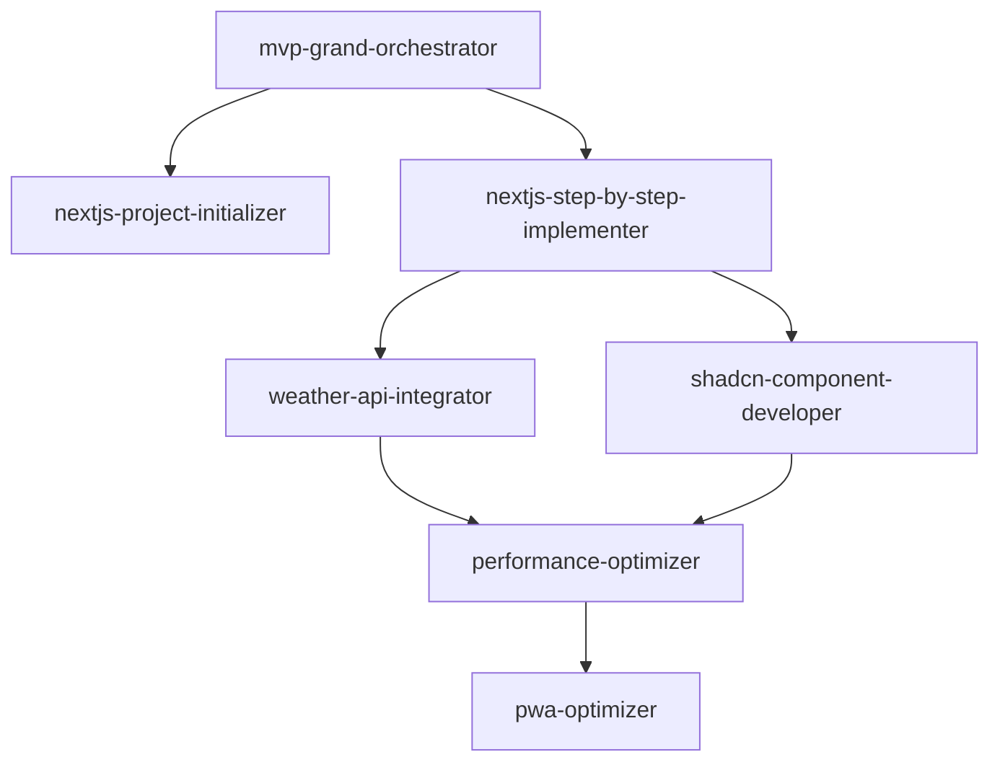

# Agent Ecosystem Management Rules

**Objective:** Create self-improving agent ecosystems that align with project tech stacks, embed domain expertise, and compound development efficiency through specialized orchestration.

## Core Agent Design Principles

### 1. Tech Stack Alignment Rule
**DO:** Always align agent capabilities with the actual tech stack
```markdown
# CORRECT: Next.js project agent
## nextjs-project-initializer.md
- Uses Next.js 14 App Router patterns
- Implements Shadcn/ui components
- Configures Tailwind CSS
- Sets up TypeScript with proper configs

# WRONG: Generic or misaligned agent
## generic-project-initializer.md
- Tech-agnostic setup
- No framework-specific optimizations
```

**DON'T:** Reuse agents from different tech stacks without full refactoring
- Rails agents won't work for Next.js projects
- Django patterns don't apply to React apps
- Backend-focused agents miss frontend requirements

### 2. Domain Expertise Embedding Rule
**DO:** Create domain-specific agents that encode business logic
```markdown
# Domain-Specific Agents Pattern
clothing-recommendation-engine.md
- Temperature zones: HOT >25°C, WARM 15-25°C, COOL 5-15°C, COLD <5°C
- Gravel-specific gear: padded gloves, bibs with chamois, jersey pockets
- Ride duration factors: 2-6 hour adjustments

weather-api-integrator.md
- Coordinate rounding to 0.1° for cache efficiency
- 3-hour minimum cache duration
- Free tier optimization (1000 calls/day)
```

**WHY:** Domain expertise in agents prevents repeated explanations and ensures consistent business logic implementation

### 3. MVP-First Philosophy Rule
**MANDATORY:** Every agent must embrace pragmatic MVP development
```markdown
## Agent MVP Checklist
- [ ] Includes "Ship fast, iterate often" mindset
- [ ] Has explicit MVP vs Future sections
- [ ] Time-boxes complex features (2-hour max)
- [ ] Prioritizes working over perfect
- [ ] Documents shortcuts taken for later refactoring
```

**Example from nextjs-step-by-step-implementer:**
```markdown
## MVP Approach
- Start with hardcoded data
- Use mock APIs initially
- Skip edge cases for v1
- Deploy incomplete but functional
- Iterate based on real usage
```

## Agent Refactoring Protocol

### 1. Stack Migration Process
When refactoring agents from one tech stack to another:

**STEP 1: Preserve Core Functionality**
```markdown
# Original (Rails)
rails-project-initializer.md
- Database setup with ActiveRecord
- MVC structure creation
- Rails-specific testing

# Refactored (Next.js)
nextjs-project-initializer.md
- Database setup with Prisma/Drizzle
- App Router structure
- Jest/Playwright testing
```

**STEP 2: Adapt Implementation Details**
- Replace framework-specific commands
- Update file structure patterns
- Adjust testing strategies
- Modify deployment approaches

**STEP 3: Deprecate Gracefully**
```bash
# Rename pattern for deprecated agents
mv rails-project-initializer.md DEPRECATED_rails-project-initializer.md
```

### 2. Agent Naming Convention
**REQUIRED FORMAT:** `[tech-stack]-[specific-function]-[role].md`

```markdown
# CORRECT Examples
nextjs-project-initializer.md       # Tech: nextjs, Function: project, Role: initializer
shadcn-component-developer.md        # Tech: shadcn, Function: component, Role: developer
weather-api-integrator.md           # Domain: weather, Function: api, Role: integrator
pwa-optimizer.md                    # Tech: pwa, Function: general, Role: optimizer

# WRONG Examples
initializer.md                      # Too generic
project-setup.md                    # Missing tech context
rails-nextjs-converter.md           # Confusing dual-tech reference
```

## Performance & Cost Optimization Rules

### 1. API Limit Awareness
Every agent dealing with external services MUST implement:
```markdown
## API Constraints
- Free tier limits: [specific numbers]
- Rate limiting strategy: [backoff approach]
- Caching requirements: [duration, strategy]
- Fallback services: [alternatives]
```

### 2. Caching Strategy Embedding
```markdown
# Weather API Example
- Round coordinates to 0.1° → 48.1351 becomes 48.1
- Cache for 3 hours minimum
- Result: 100x reduction in API calls
```

## Agent Ecosystem Composition

### 1. Core Agent Categories
Every project should have agents in these categories:

**Infrastructure Agents**
- `[tech]-project-initializer`: Project setup and configuration
- `[tech]-environment-setup`: Development environment preparation

**Implementation Agents**
- `[tech]-step-by-step-implementer`: Feature development
- `[ui-framework]-component-developer`: UI component creation

**Domain Agents**
- Business logic specific (e.g., `clothing-recommendation-engine`)
- Integration specific (e.g., `weather-api-integrator`)

**Quality Agents**
- `performance-optimizer`: Speed and efficiency
- `[tech]-optimizer`: Tech-specific optimizations (e.g., `pwa-optimizer`)

### 2. Agent Interaction Patterns


## Continuous Agent Evolution

### 1. Pattern Recognition Rule
After 3+ similar implementations, create or update an agent:
```markdown
# Trigger: Same weather caching logic in 3 files
# Action: Update weather-api-integrator.md with:
## Standard Caching Pattern
- Coordinate rounding function
- Cache key generation
- TTL configuration
```

### 2. Learning Integration
Every agent refactoring MUST update:
1. This rule file with new patterns
2. Agent README.md with ecosystem changes
3. Deprecated agents with migration notes
4. Project CLAUDE.md with agent usage

### 3. Agent Testing Protocol
```markdown
## Agent Validation Checklist
- [ ] Aligns with current tech stack
- [ ] Contains domain-specific knowledge
- [ ] Implements MVP-first approach
- [ ] Has clear success criteria
- [ ] Includes example outputs
- [ ] References related agents
```

## Anti-Patterns to Avoid

**❌ Generic Agents Without Context**
- "code-writer.md" without tech stack specifics
- "api-integrator.md" without service details

**❌ Overly Complex Agent Networks**
- More than 7 agents in a handoff chain
- Circular dependencies between agents

**❌ Outdated Tech References**
- Rails patterns in Next.js agents
- Class components in React 18+ agents
- Pages Router in Next.js 14+ projects

**❌ Missing Domain Context**
- Weather app without temperature zones
- E-commerce without payment flows
- Fitness app without activity types

## Compound Benefits

This agent ecosystem approach creates exponential improvements:

1. **Refactoring Once = Template Forever**: Rails→Next.js refactoring becomes a template for future migrations
2. **Domain Encoding = Consistent Logic**: Business rules in agents ensure uniform implementation
3. **Performance Patterns = Cost Savings**: Embedded optimizations (caching, rounding) compound across all uses
4. **MVP Philosophy = Faster Shipping**: Every agent pushing for quick deployment accelerates overall velocity
5. **Clear Naming = Instant Understanding**: Tech-appropriate names eliminate confusion and wrong agent selection

## Integration with Other Rules

- **Compound Engineering Core**: Agents are systems that create systems
- **Performance Requirements**: Performance agents enforce project-wide standards
- **API Integration Patterns**: API agents implement consistent integration approaches
- **UI Component Patterns**: UI agents maintain design system consistency

## Metadata for Continuous Improvement

**Creation Context:**
- Refactored 6 Rails agents to Next.js equivalents
- Created 4 new domain-specific agents
- Discovered patterns in API optimization and caching
- Embedded gravel cycling domain expertise

**Next Evolution Triggers:**
- Introduction of new tech stack (e.g., mobile app)
- Discovery of repeated agent patterns
- Performance bottlenecks in agent orchestration
- New domain requirements emerging